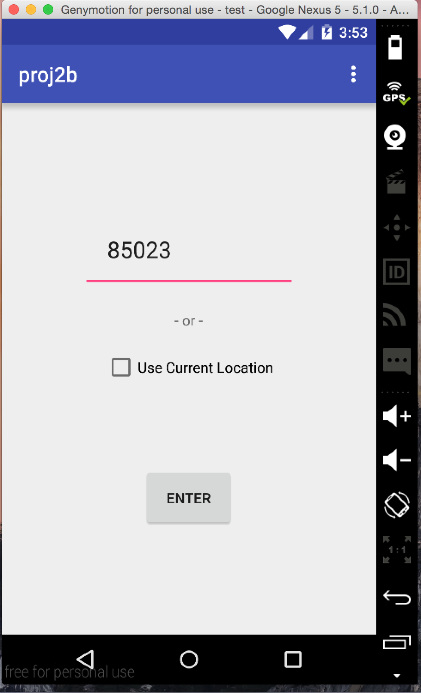

# PROG 02: Represent!

Briefly describe your app here.

Note

Right now there is a ShakeDetector.java file inside app/wear/java. Ignore this for Proj 2B. This file does nothing. The shake is implemented inside MainWearActivity.

Jazz folder contains all my android project. It is called Jazz because out of the multiple projects I worked on, Jazz is the only one that completed the assignment. No it is not related to music.

The Apk folder contains apk files and App folder contains the source code from the Jazz folder.

## Authors

David Koh ([dkoh@berkeley.edu](mailto:your_email@berkeley.edu))

## Demo Video

See [Proj2B] (https://www.youtube.com/watch?v=y1zq34ZYDWc)

## Screenshots

## Acknowledgments

* Hat tip to anyone who's code was used
* Any other support

Thank you Google and Stack Overflow!!
