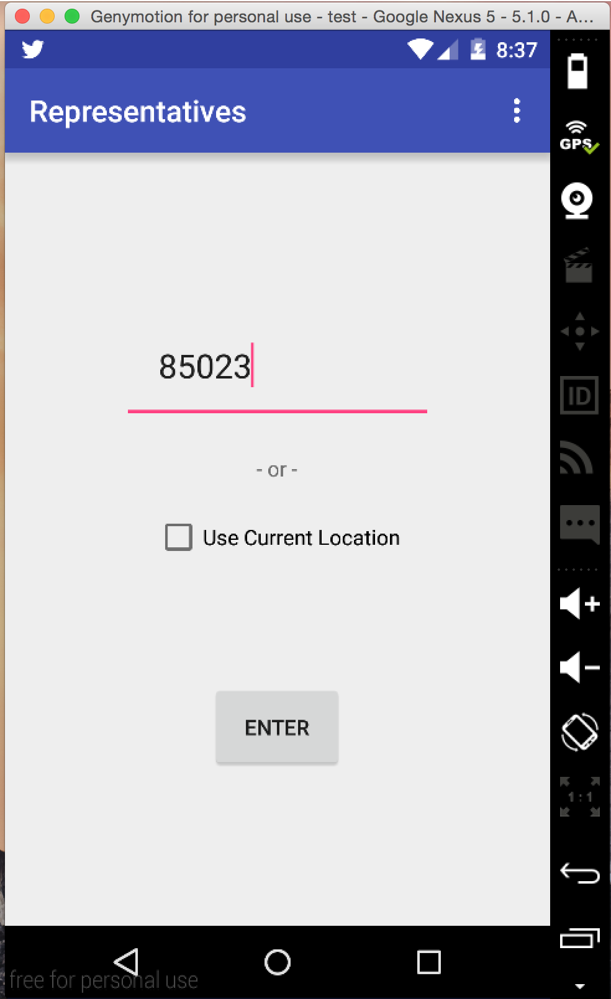

# PROG 02: Represent!

Briefly describe your app here.

Note

The Apk folder contains apk files and App folder contains the source code from the Jazz folder.

## Authors

David Koh ([dkoh@berkeley.edu](mailto:dkoh@berkeley.edu))

## Demo Video

See [Proj2B] (https://www.youtube.com/watch?v=y1zq34ZYDWc)

See [Final Project 2] (https://youtu.be/tXBKJsUqoBw)

## Screenshots

## Acknowledgments

* Hat tip to anyone who's code was used
* Any other support

Thank you Google and Stack Overflow!!
